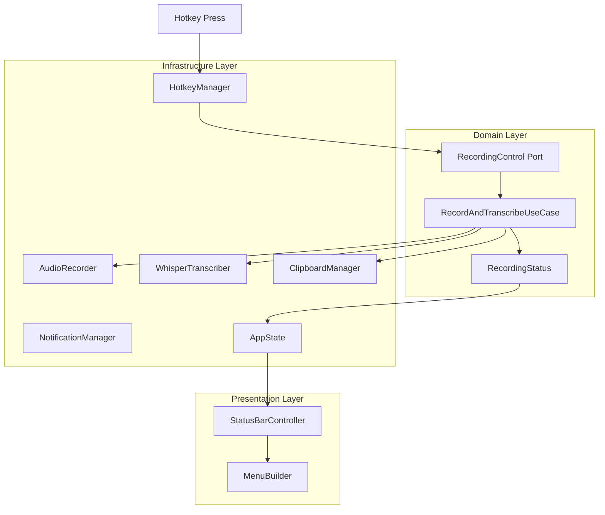
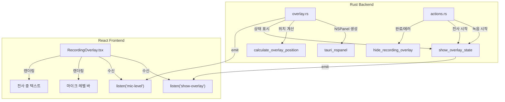
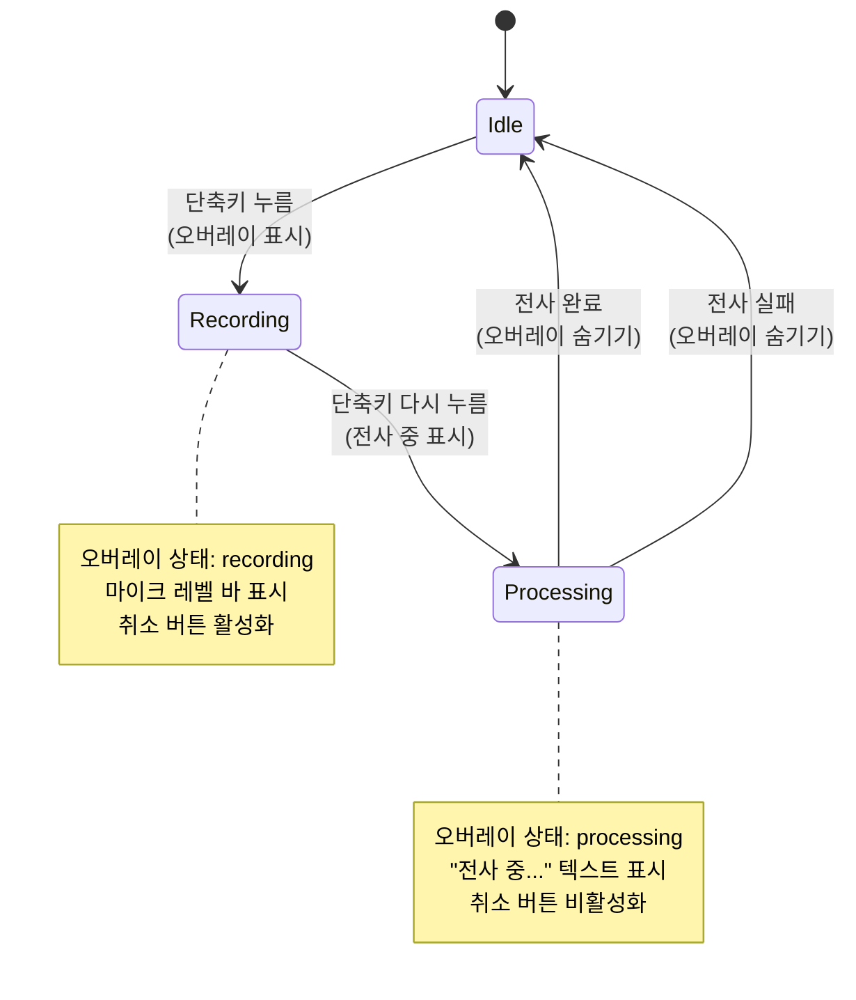
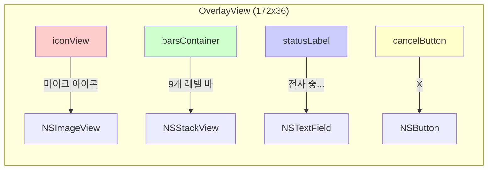
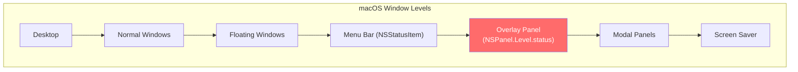
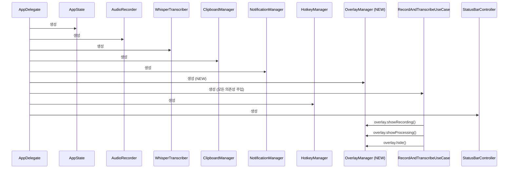
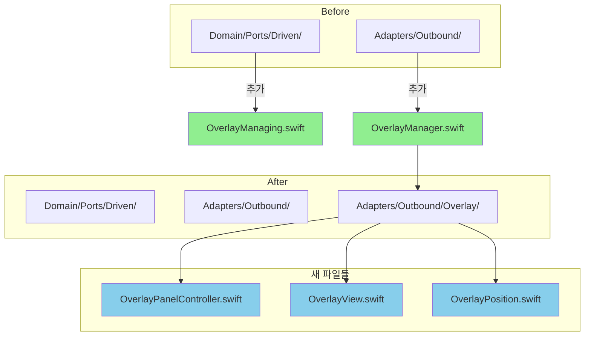
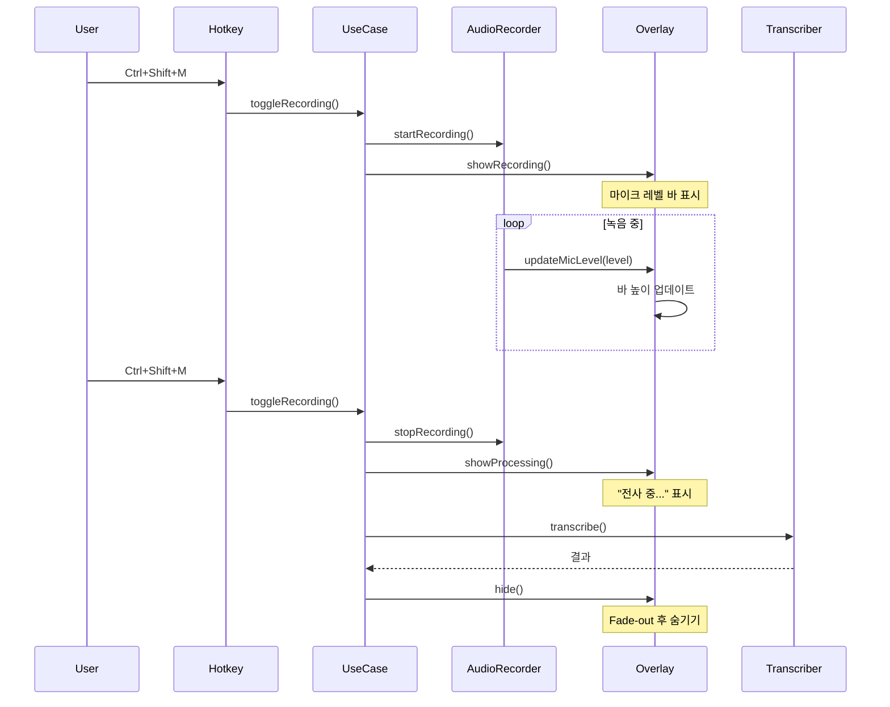

# 녹음 상태 오버레이 아키텍처 다이어그램

## 1. 현재 VoiceRecorder 아키텍처



## 2. Handy 오버레이 아키텍처 (참고)



## 3. 제안하는 Swift 오버레이 아키텍처

```mermaid
graph TB
    subgraph "Domain Layer"
        D1[RecordAndTranscribeUseCase]
        D2[RecordingStatus]
        D3["OverlayManaging Port<br/>(NEW)"]
    end
    
    subgraph "Adapter Layer - Outbound"
        E1[OverlayManager<br/>(NEW)]
        E2[OverlayPanelController<br/>(NEW)]
        E3[OverlayView<br/>(NEW)]
        E4[OverlayPosition<br/>(NEW)]
    end
    
    subgraph "Adapter Layer - Inbound"
        A1[StatusBarController]
    end
    
    subgraph "App Layer"
        AP1[AppDelegate]
    end
    
    D1 --> |"showRecording()"| D3
    D1 --> |"showProcessing()"| D3
    D1 --> |"hide()"| D3
    D3 --> |"구현"| E1
    E1 --> |"관리"| E2
    E2 --> |"NSPanel"| E5[NSPanel]
    E5 --> |"contentView"| E3
    E4 --> |"position"| E2
    
    AP1 --> |"DI"| E1
    D2 --> |"상태 변경"| D1
```

## 4. 상태 전환 흐름도



## 5. 오버레이 UI 구조



## 6. NSPanel 윈도우 계층



## 7. 의존성 주입 흐름



## 8. 파일 구조 변경



## 9. Handy vs VoiceRecorder 기능 비교

```mermaid
graph LR
    subgraph "Handy (Rust/React)"
        H1[NSPanel via tauri_nspanel]
        H2[React 컴포넌트]
        H3[Tauri 이벤트]
        H4["emit('mic-level')"]
    end
    
    subgraph "VoiceRecorder (Swift)"
        V1[NSPanel native]
        V2[NSView + AppKit]
        V3[Protocol + Delegate]
        V4[OverlayManaging.updateMicLevel()]
    end
    
    H1 -.->|"동일"| V1
    H2 -.->|"변환"| V2
    H3 -.->|"변환"| V3
    H4 -.->|"변환"| V4
```

## 10. 타이밍 다이어그램


