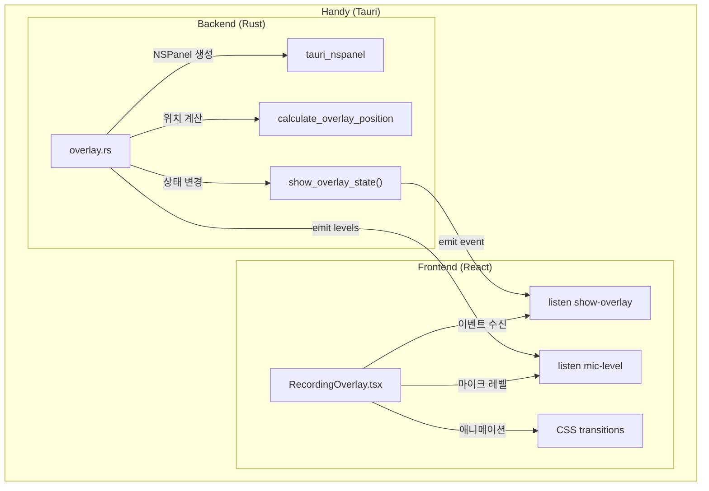
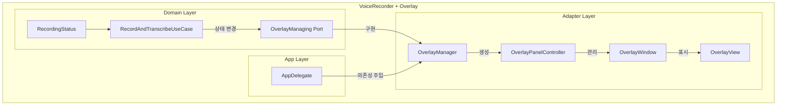
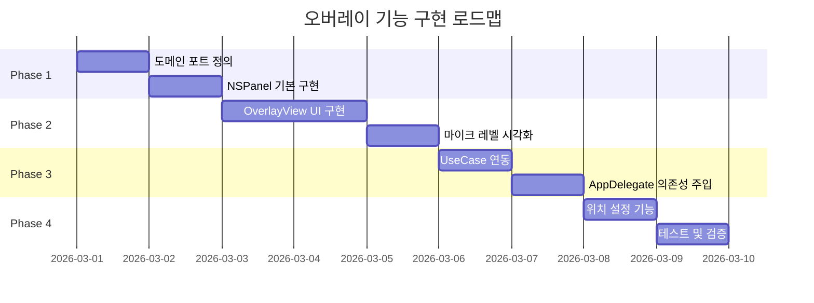

# 녹음 상태 오버레이 기능 구현 계획서

## 1. 개요

### 1.1 목적

VoiceRecorder macOS 앱에 **화면 오버레이** 기능을 추가하여, 사용자가 단축키로 녹음을 시작했을 때 화면 상단/하단에 녹음 상태를 시각적으로 표시합니다.

### 1.2 참고 프로젝트: Handy

Handy 프로젝트는 Tauri 기반 음성 인식 앱으로, macOS에서 `NSPanel`을 활용한 오버레이 기능을 구현했습니다.

**Handy 오버레이 특징:**
- 마이크 레벨 시각화 (바 형태)
- 전사 중 상태 표시
- 취소 버튼
- 상단/하단 위치 설정 지원
- 투명 배경 + 둥근 모서리
- 모든 Space에서 표시 (Desktop 포함)

---

## 2. 아키텍처 분석

### 2.1 현재 VoiceRecorder 아키텍처

```
VoiceRecorder (Hexagonal Architecture)
├── Domain
│   ├── Entities
│   │   └── RecordingStatus (idle, recording, processing)
│   ├── Ports
│   │   ├── Driving (RecordingControl)
│   │   └── Driven (AudioRecording, Transcribing, ...)
│   └── UseCases
│       └── RecordAndTranscribeUseCase
├── Adapters
│   ├── Inbound (StatusBarController, MenuBuilder)
│   └── Outbound (AudioRecorder, WhisperTranscriber, ...)
└── App (AppDelegate - Composition Root)
```

### 2.2 Handy 오버레이 아키텍처



### 2.3 제안하는 Swift 오버레이 아키텍처



---

## 3. 상세 설계

### 3.1 새로 추가할 파일 구조

```
VoiceRecorder/Sources/VoiceRecorder/
├── Domain/
│   └── Ports/
│       └── Driven/
│           └── OverlayManaging.swift          # NEW: 오버레이 포트
└── Adapters/
    └── Outbound/
        ├── OverlayManager.swift               # NEW: 오버레이 관리자
        └── Overlay/
            ├── OverlayPanelController.swift   # NEW: NSPanel 컨트롤러
            ├── OverlayView.swift              # NEW: 오버레이 UI 뷰
            └── OverlayPosition.swift          # NEW: 위치 설정 enum
```

### 3.2 도메인 포트 정의

```swift
// Domain/Ports/Driven/OverlayManaging.swift

protocol OverlayManaging {
    /// 오버레이 표시 (녹음 중)
    func showRecording()
    
    /// 전사 중 오버레이 표시
    func showProcessing()
    
    /// 오버레이 숨기기
    func hide()
    
    /// 마이크 레벨 업데이트 (0.0 ~ 1.0)
    func updateMicLevel(_ level: Float)
    
    /// 오버레이 위치 설정
    func setPosition(_ position: OverlayPosition)
}

enum OverlayPosition: String, Codable {
    case none
    case top
    case bottom
}
```

### 3.3 NSPanel 구현 (macOS 네이티브)

Handy의 Rust 코드를 Swift로 변환:

```swift
// Adapters/Outbound/Overlay/OverlayPanelController.swift

import AppKit

final class OverlayPanelController {
    private var panel: NSPanel?
    private let overlayView: OverlayView
    
    // Handy 설정값 대응
    private let overlayWidth: CGFloat = 172.0
    private let overlayHeight: CGFloat = 36.0
    private let topOffset: CGFloat = 46.0      // macOS menu bar 고려
    private let bottomOffset: CGFloat = 15.0
    
    init() {
        self.overlayView = OverlayView()
        setupPanel()
    }
    
    private func setupPanel() {
        let panel = NSPanel(
            contentRect: NSRect(x: 0, y: 0, width: overlayWidth, height: overlayHeight),
            styleMask: [.borderless, .nonactivatingPanel],
            backing: .buffered,
            defer: false
        )
        
        // Handy의 tauri_nspanel 설정 대응
        panel.level = .status              // PanelLevel::Status
        panel.collectionBehavior = [
            .canJoinAllSpaces,             // can_join_all_spaces
            .fullScreenAuxiliary           // full_screen_auxiliary
        ]
        panel.isFloatingPanel = true       // is_floating_panel: true
        panel.becomesKeyOnlyIfNeeded = true // can_become_key_window: false
        panel.hidesOnDeactivate = false
        
        // 투명 배경
        panel.isOpaque = false
        panel.backgroundColor = .clear
        panel.hasShadow = false
        
        // 컨텐츠 뷰 설정
        overlayView.frame = NSRect(x: 0, y: 0, width: overlayWidth, height: overlayHeight)
        panel.contentView = overlayView
        
        self.panel = panel
    }
    
    func show(at position: OverlayPosition, state: OverlayState) {
        guard let panel, position != .none else { return }
        
        // 위치 계산 (Handy의 calculate_overlay_position 대응)
        let screen = getScreenWithCursor()
        let frame = screen?.visibleFrame ?? NSScreen.main?.visibleFrame ?? .zero
        
        let x = frame.origin.x + (frame.width - overlayWidth) / 2
        let y: CGFloat
        switch position {
        case .top:
            y = frame.origin.y + frame.height - overlayHeight - topOffset
        case .bottom:
            y = frame.origin.y + bottomOffset
        case .none:
            return
        }
        
        panel.setFrameOrigin(NSPoint(x: x, y: y))
        overlayView.setState(state)
        panel.makeKeyAndOrderFront(nil)
        
        // Fade-in 애니메이션
        animateIn()
    }
    
    func hide() {
        animateOut { [weak self] in
            self?.panel?.orderOut(nil)
        }
    }
    
    private func getScreenWithCursor() -> NSScreen? {
        let mouseLocation = NSEvent.mouseLocation
        return NSScreen.screens.first { screen in
            screen.frame.contains(mouseLocation)
        } ?? NSScreen.main
    }
}
```

### 3.4 오버레이 UI 뷰

```swift
// Adapters/Outbound/Overlay/OverlayView.swift

import AppKit

enum OverlayState {
    case recording
    case processing
}

final class OverlayView: NSView {
    private let iconView = NSImageView()
    private let barsContainer = NSStackView()
    private let statusLabel = NSTextField()
    private let cancelButton = NSButton()
    
    private var bars: [NSView] = []
    private var currentState: OverlayState = .recording
    
    override init(frame frameRect: NSRect) {
        super.init(frame: frameRect)
        setupUI()
    }
    
    private func setupUI() {
        // 배경 스타일 (Handy: background: #000000cc, border-radius: 18px)
        wantsLayer = true
        layer?.backgroundColor = NSColor.black.withAlphaComponent(0.8).cgColor
        layer?.cornerRadius = 18
        
        // 레이아웃 설정
        // iconView | barsContainer/statusLabel | cancelButton
        
        setupBars() // 9개의 마이크 레벨 바
    }
    
    func setState(_ state: OverlayState) {
        currentState = state
        
        switch state {
        case .recording:
            barsContainer.isHidden = false
            statusLabel.isHidden = true
            cancelButton.isHidden = false
        case .processing:
            barsContainer.isHidden = true
            statusLabel.isHidden = false
            statusLabel.stringValue = "전사 중..."
            cancelButton.isHidden = true
        }
    }
    
    func updateMicLevels(_ levels: [Float]) {
        // Handy: smoothed = prev * 0.7 + target * 0.3
        for (index, bar) in bars.enumerated() {
            let level = levels[safe: index] ?? 0
            let height = 4 + CGFloat(pow(Double(level), 0.7)) * 16
            bar.frame.size.height = min(height, 20)
            bar.alphaValue = max(0.2, CGFloat(level) * 1.7)
        }
    }
}
```

### 3.5 UseCase 연동

```swift
// RecordAndTranscribeUseCase.swift (수정)

final class RecordAndTranscribeUseCase: RecordingControl {
    // 새로 추가
    private let overlay: OverlayManaging
    
    init(
        // 기존 의존성...
        overlay: OverlayManaging  // NEW
    ) {
        self.overlay = overlay
    }
    
    private func startRecording() {
        // 기존 코드...
        try audioRecorder.startRecording()
        
        appState.recordingStatus = .recording
        overlay.showRecording()  // NEW: 오버레이 표시
        
        onStateChanged?()
    }
    
    private func stopRecording(language: String) {
        // 기존 코드...
        
        appState.recordingStatus = .processing
        overlay.showProcessing()  // NEW: 전사 중 표시
        
        onStateChanged?()
    }
    
    private func transcribeAndPaste(_ samples: [Float], language: String) {
        // 전사 완료 후
        await MainActor.run { [weak self] in
            self?.appState.recordingStatus = .idle
            self?.overlay.hide()  // NEW: 오버레이 숨기기
            self?.onStateChanged?()
        }
    }
}
```

---

## 4. 구현 로드맵



---

## 5. Handy 대비 기능 매핑

| 기능 | Handy (Rust/React) | VoiceRecorder (Swift) |
|------|-------------------|----------------------|
| 윈도우 타입 | NSPanel (via tauri_nspanel) | NSPanel (native) |
| 레벨 | PanelLevel::Status | NSWindow.Level.status |
| CollectionBehavior | can_join_all_spaces, full_screen_auxiliary | .canJoinAllSpaces, .fullScreenAuxiliary |
| 투명 배경 | transparent: true | isOpaque=false, backgroundColor=.clear |
| 마이크 레벨 | emit "mic-level" event | OverlayManaging.updateMicLevel() |
| 상태 변경 | emit "show-overlay" event | OverlayManaging.showRecording() |
| 취소 버튼 | commands.cancelOperation() | UseCase.cancel() |

---

## 6. 주요 구현 포인트

### 6.1 NSPanel vs NSWindow

```
NSPanel은 NSWindow의 서브클래스로, 다음과 같은 이점이 있습니다:
- 시스템 메뉴/Modal 대화상자 아래에 표시 가능 (level: .status)
- 활성화되지 않고도 표시 가능 (nonactivatingPanel)
- Dock에 표시되지 않음
- 모든 Space에서 자동으로 표시 가능
```

### 6.2 마우스 커서가 있는 화면 감지

```swift
// Handy의 get_monitor_with_cursor() 대응
private func getScreenWithCursor() -> NSScreen? {
    let mouseLocation = NSEvent.mouseLocation
    return NSScreen.screens.first { screen in
        screen.frame.contains(mouseLocation)
    } ?? NSScreen.main
}
```

### 6.3 Fade In/Out 애니메이션

```swift
private func animateIn() {
    panel?.alphaValue = 0
    NSAnimationContext.runAnimationGroup { context in
        context.duration = 0.3
        panel?.animator().alphaValue = 1
    }
}

private func animateOut(completion: @escaping () -> Void) {
    NSAnimationContext.runAnimationGroup { context in
        context.duration = 0.3
        panel?.animator().alphaValue = 0
    } completionHandler: {
        completion()
    }
}
```

---

## 7. 설정 저장

기존 `AppConfig`에 오버레이 위치 설정 추가:

```swift
// Adapters/Outbound/AppConfig.swift

struct AppConfig: Codable {
    var recordHotkey: String
    var langHotkey: String
    var language: String
    var model: String
    var overlayPosition: String = "bottom"  // NEW: "none", "top", "bottom"
}
```

---

## 8. 참고 자료

- [Handy overlay.rs](../Handy/src-tauri/src/overlay.rs) - Rust NSPanel 구현
- [Handy RecordingOverlay.tsx](../Handy/src/overlay/RecordingOverlay.tsx) - React 오버레이 UI
- [Apple NSPanel Documentation](https://developer.apple.com/documentation/appkit/nspanel)
- [NSWindow Collection Behavior](https://developer.apple.com/documentation/appkit/nswindow/collectionbehavior)

---

## 9. 요약

이 계획서는 Handy 프로젝트의 오버레이 구현을 참고하여 VoiceRecorder Swift 앱에 동일한 기능을 추가하는 방법을 설명합니다. 핵심은:

1. **NSPanel**을 사용하여 시스템 윈도우 위에 표시
2. **Hexagonal Architecture** 준수 - OverlayManaging 포트 추가
3. **마이크 레벨 시각화**로 사용자 피드백 제공
4. **위치 설정** (상단/하단/없음) 지원
5. **Fade 애니메이션**으로 부드러운 전환

이를 통해 사용자는 녹음 중일 때 화면에 명확한 시각적 피드백을 받을 수 있습니다.
